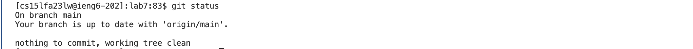

## Logging into ieng6:
To log into the ieng6 remote server, I opened up a new terminal. Then, I typed "`ssh cs15lfa23lw@ieng6.ucsd.edu`". Then I pressed `<enter>`. This command logs me into the ieng6 remote server, which I don't need a password for anymore because I set up a public/private key for it in a previous lab.  

Here is the screenshot:

## Git Cloning the Repository:
To clone the repository, I went on the github page and got the link for it (the SSH url). I copied it to my clipboard using the button next to the url. Then I went to my VSCode terminal and 
typed "`git clone`" `<command> C` into the command line. This results in the command `git clone git@github.com:Phil5184/lab7.git`, then I pressed `<enter>`. `<command> C` copies the url from my clipboard onto the command line, then the command `git clone git@github.com:Phil5184/lab7.git` clones the repository.  

Here is the screenshot:

## Running the Tests;
To run the tests, I didn't want to use the long `javac` and `java` commands, and I knew there was a bash script for running the tests, so in order to run the bash script, I first had to change my working directory to the appropriate one.
I typed "`cd lab7`" into the command line, then pressed `<enter>`. Then I typed "`bash test.sh`" into the command line, and pressed `<enter>`. The command `cd lab7` changes my working directory to the `lab7` directory, which is where the bash test script is. The command `bash test.sh` runs the bash test script, which runs the tests in the file `ListExamplesTests.java`.  

Here is the screenshot:

## Editing the Code File: 
To edit the code file, I used `vim`. I first typed in "`vim ListExamples.java`". This opens up a view of the `ListExamples.java` file in vim normal mode. My cursor was at the top line originally, so I held "`j`" (which acts as `<down>`) until I was at the last line (line 50). Then I pressed "`k`" (which acts as `<up>`) 6 times to get to line 44, which is where the error in the code is. I pressed "`l`" (which acts as `<right>`) 11 times to get to the 12th character in line 44, and pressed "`x`" to delete the character. After this I had to enter insert mode, so I pressed `i`. Now that I was in insert mode, I could make actual edits in the file, so I pressed "`2`". This was the only edit I needed to make, so I exited out of insert mode by pressing "`<esc>`". This puts me back into normal mode. The last thing I needed to do was save and exit the file. I pressed "`:wq`" to do this.  

In summary, the edits I made were just changing the `index1 += 1;` on line 44 to `index2 += 1;`.  

To check that the edits I made were saved, I pressed the `<up>` arrow to get back my previous command, which was `vim ListExamples.java`. Then I pressed `<enter>` to run the command, and looked through `ListExamples.java` to make sure my edit was there. After that I just exited with `:q`.

Here is the screenshot:

## Running the Tests again:
To run the tests again, I knew I had the `bash test.sh` command somewhere in my history, so I pressed the `<up>` arrow 6 times until I got back the to the `bash test.sh` command. Then I pressed `<enter>` to run the test bash script. The tests passed. 
Here is the screenshot:

## Commit and Push:
To commit and push, first I had to add the `ListExamples.java` file to the commit. I typed in `git status` and pressed `<enter>`, just to get a visual check and see that there were modified changes to `ListExamples.java` that weren't yet staged for commit. So I typed in the command `git add ListExamples.java`, and pressed `<enter>`. This will add the changes made in `ListExamples.java` to the next commit. Then I pressed the `<up>` arrow twice to get back by `git status` command, and pressed `<enter>`. This was just to make sure that `ListExamples.java` was staged for the next commit.  

After that, I could go ahead and commit by typing in the command `git commit -m 'edited the file to fix the error'` and pressing `<enter>`. The "edited the file to fix the error" was the commit message that I wanted to add. To finally push the change, I typed in the command `git push` and pressed `<enter>`. Now everything was commited and pushed. To check one last time, I pressed the `<up>` arrow 3 times to get back my `git status` command, and pressed `<enter>`. It showed that there was nothing to commit, which is what I wanted to see.  

Here are the screenshots: (I took 3 screenshots for this step since there were a lot of commands that I ran)

