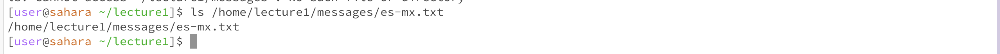

The working directory when this code was run was the /home directory. 
There was no output because the command cd changes the directory to whatever argument you put in, so since I put in no arguments, there was no change in directory or output to be made. 
This output is not an error.

The working directory when this code was run was the /home directory. There was no output, but the working directory after running the code did change to the /lecture1 directory. This is the expected result/output, since the cd command changes the directory to the argument that you put in, and my argument was "/home/lecture1", so the directory changed to /lecture 1. This is not an error. 

The working directory when this code was run was the /lecture1 directory. The output was an error message saying that the path to the file that i put in as the argument is "not a directory". This is because the cd command works to change directories, and if you put in an argument that is not a directory, the command cannot work. This is an error because we tried using a file as the argument for cd, and the working directory cannot be changed to something that is a file (like en-us.txt). 

The working directory when this code was run was the /lecture1 directory. The output was a list of all the files and folders that are "inside" of lecture1. This is because the ls command returns a list of the folders and files inside of the current working directory (or the current argument), and if the current working directory is /lecture1, then the ls command will show all files inside lecture1. This is not an error. 

The working directory when this code was run was the /lecture1 directory, like before. The output was the same as before because the argument I put was "/home/lecture1" and the ls command returns the files and folders inside of the argument (lecture1). This is expected and is not an error. 

