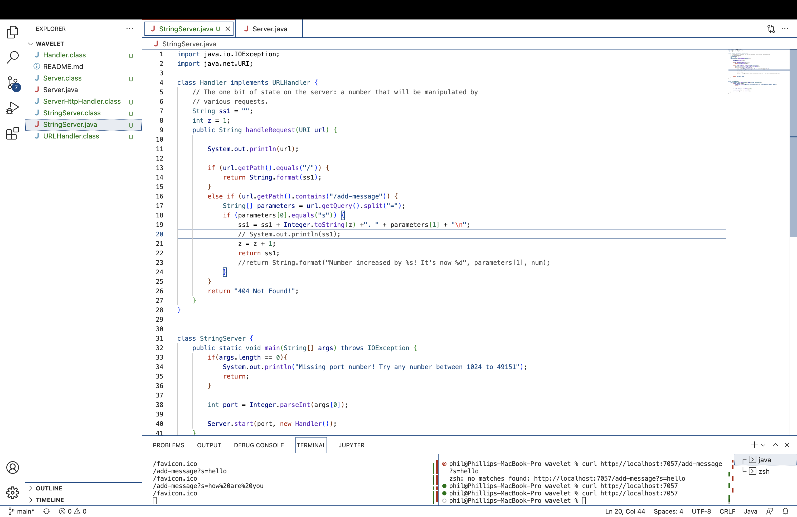
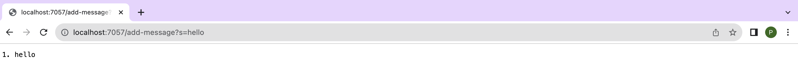
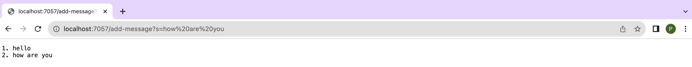
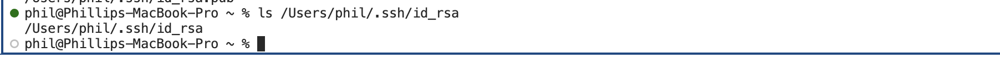
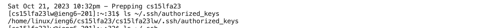
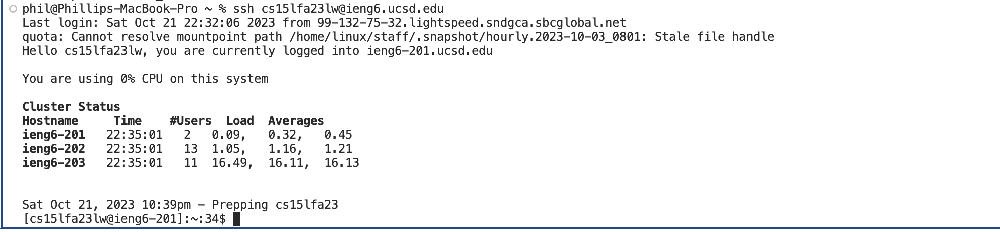

## StringServer Code

##  First Screenshot of using `/add-message`

The method in my code that was called was the `handleRequest` method (The main method inside of the `StringServer` class was obviously called as well when the server started). The relevant fields inside the `Handler` class was a `String` variable that I named `ss1`, which was the string that would be continuously added onto and shown on the web server. There was also a `int` `z` variable that tracked the number of the lines of the string shown in the web server, as well as the `URI` `url` variable that served as the method argument. The method argument `URI` `url`  was updated to have the path and query `/add-message?s=hello` to call the method request. The `ss1` `String` variable initially stored just a empty `String`, but after the request was called, it then stored the `String` `"1. hello"`. The `int` `z` variable was also updated to `2` to track the next line number. 

## Second Screenshot of Using `/add-message`

The method in my code that was called was the `handleRequest` method. The relevant fields inside the `Handler` class was a `String` variable that I named `ss1`, which was the string that would be continuously added onto and shown on the web server. There was also a `int` `z` variable that tracked the number of the lines of the string shown in the web server, as well as the `URI` `url` (the method argument) that stores the url of the web server. To call the method request, the `URI``url` method argument was updated with the path and query `/add-message?s=how are you`. The `ss1` `String` variable initially stored `"1. hello"` before the request above was called, but after the request was called, it then stored the `String` `"1. hello \n 2. how are you"`. The `int` `z` variable was also updated to `3` to track the next line number. 

## Path to the Private key for logging into `ieng6`

## Path to the Public key for logging into `ieng6`

## Terminal Interaction of logging into `ieng6` without being prompted for a password

## Something I learned from Week 2 or 3 lab that I didn't know before:
I learned that you can make private and public keys to log into the remote lab computers without having to type in a password every time. This is very useful. Even if it doesn't save that much time during each login, over time it will be a lot more convenient and save more and more time. 
