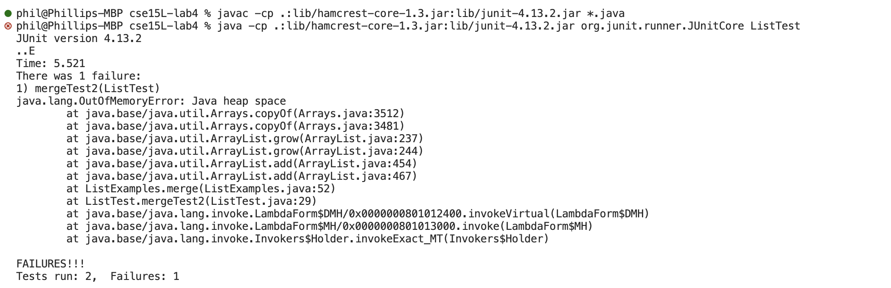

## Bug from Lab4 - Failure Inducing Input:
I decided to choose the merge test from ListExamples as my bug. Here is the failure-inducing test input:  

`@Test  
    public void mergeTest2() {  
        List<String> input1 = new ArrayList<>(Arrays.asList("a", "b", "c", "d", "e"));  
        List<String> input2 = new ArrayList<>(Arrays.asList("h", "i"));  
        List<String> output1 = new ArrayList<>(Arrays.asList("a", "b", "c", "d", "e", "h", "i"));  
        assertEquals(output1, ListExamples.merge(input1, input2));  
    }`

## Bug from Lab4 - Successful Input:
Here is the successful test input:  

`@Test
    public void mergeTest1() {
        List<String> input1 = new ArrayList<>(Arrays.asList("a", "b", "c", "h", "i"));
        List<String> input2 = new ArrayList<>(Arrays.asList("d", "e"));
        List<String> output1 = new ArrayList<>(Arrays.asList("a", "b", "c", "d", "e", "h", "i"));
        assertEquals(output1, ListExamples.merge(input1, input2));
    }`

## Symptoms of the 2 Tests above:
Here are the screenshots for the outputs of the 2 tests above after running them at the command line.

## The Bug (in the Merge method in ListExamples)
Here is the buggy code:  

`static List<String> merge(List<String> list1, List<String> list2) {
    List<String> result = new ArrayList<>();
    int index1 = 0, index2 = 0;
    while(index1 < list1.size() && index2 < list2.size()) {
      if(list1.get(index1).compareTo(list2.get(index2)) < 0) {
        result.add(list1.get(index1));
        index1 += 1;
      }
      else {
        result.add(list2.get(index2));
        index2 += 1;
      }
    }
    while(index1 < list1.size()) {
      result.add(list1.get(index1));
      index1 += 1;
    }
    while(index2 < list2.size()) {
      result.add(list2.get(index2));
      index1 += 1;
    }
    return result;
  }`

Here is the fixed code:  

`static List<String> merge(List<String> list1, List<String> list2) {
    List<String> result = new ArrayList<>();
    int index1 = 0, index2 = 0;
    while(index1 < list1.size() && index2 < list2.size()) {
      if(list1.get(index1).compareTo(list2.get(index2)) < 0) {
        result.add(list1.get(index1));
        index1 += 1;
      }
      else {
        result.add(list2.get(index2));
        index2 += 1;
      }
    }
    while(index1 < list1.size()) {
      result.add(list1.get(index1));
      index1 += 1;
    }
    while(index2 < list2.size()) {
      result.add(list2.get(index2));
      index2 += 1;
    }
    return result;
  }`

The reason why the method was buggy in the beginning was that if your inputs for the method arguments (`list1` and `list2`) were sorted in such a way that the variable `index1` in the method reached the end of `list1` before `index2` reached the end of `list2`, then the method would jump to the 3rd while loop, to finish looping through `list2`. However, inside of the 3rd while loop, instead of updating index2 to continue running through each index in `list2`, the loop would update `index1`. This led to `index1` continuously being updated over and over again while the same element from `list2` was continously added. Thus the Out of Memory Error. 
  
